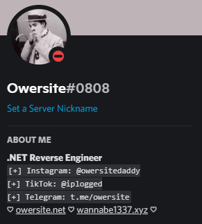

<h1 align="center"> Owersite </h1>

<div align="center">
 
```python
Welcome to my github profile!
```

</div>


<div align="center">
  
#### About me

</h1>

```python
✨ I know C-SHARP and .NET Reverse Engineering, i find Reverse Engineering magical. ✨
🌴 I started learning Python! 🌴
```


***


<a href="https://github.com/owersite?tab=repositories">
      
    </a>
    <a href="https://github.com/owersite">
      
    </a>


    
###### Discord: wisdom#4433 , Owersite#0808
###### Telegram: @owersite




